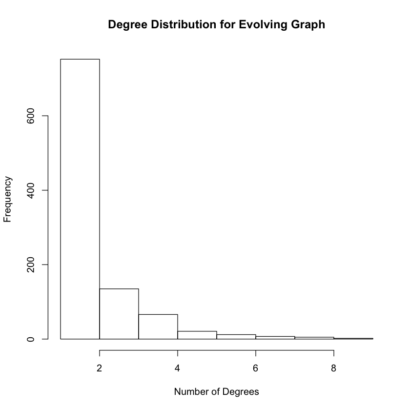
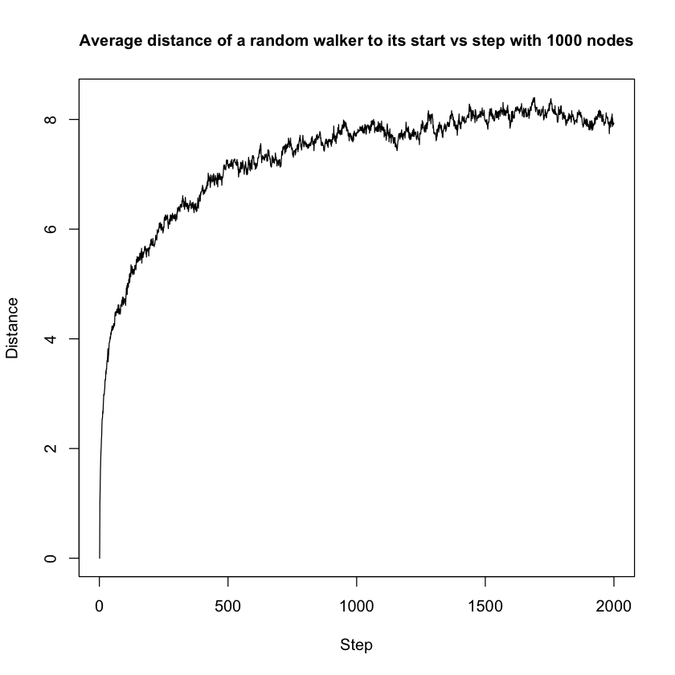
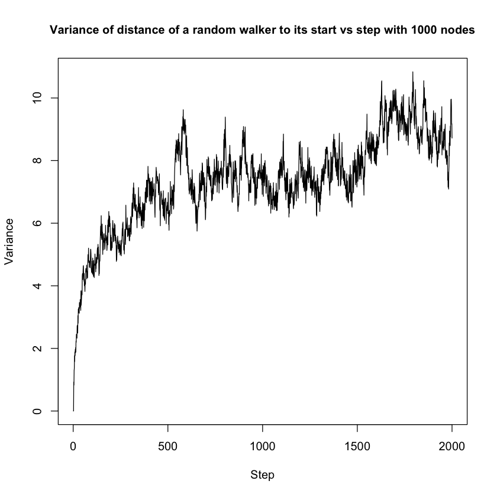
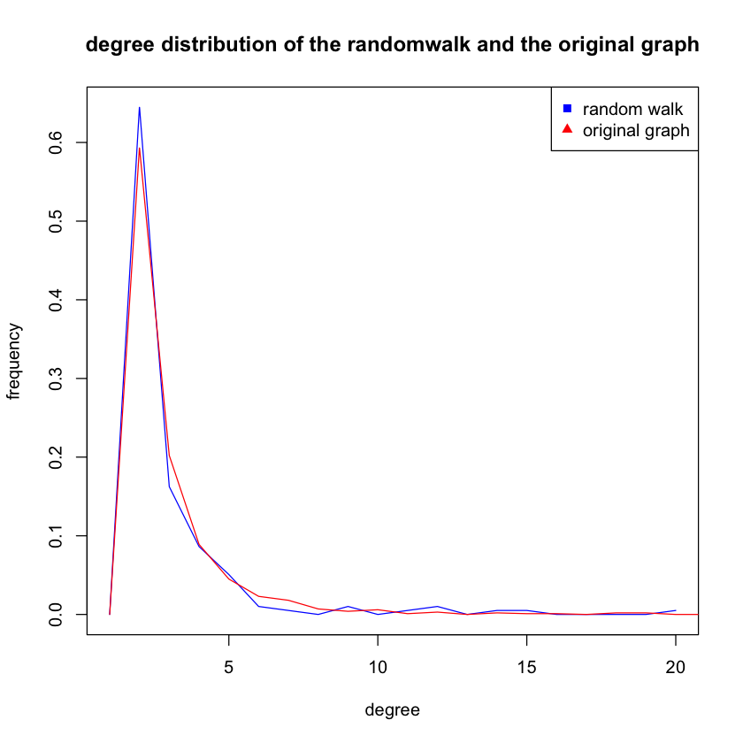
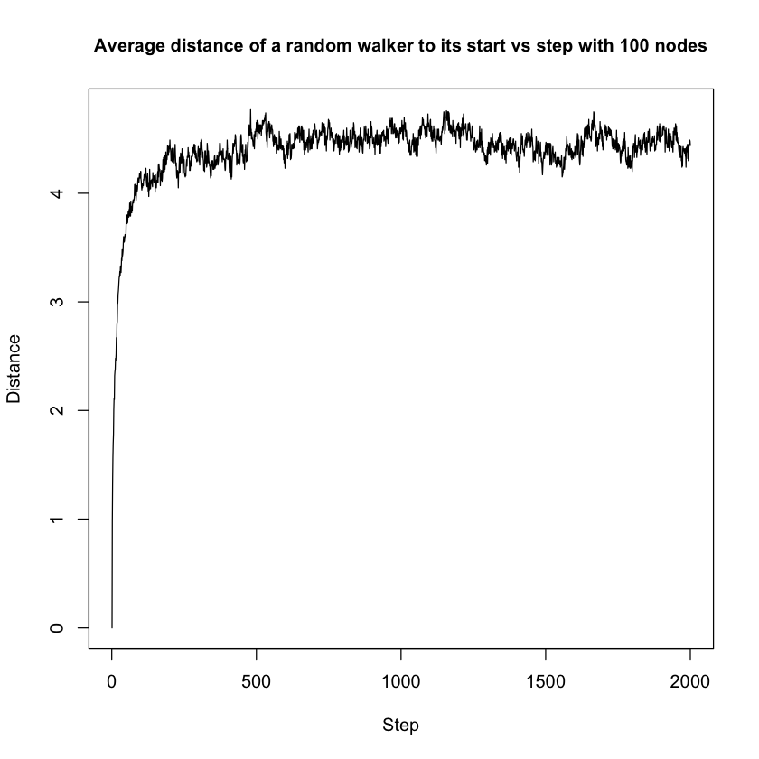
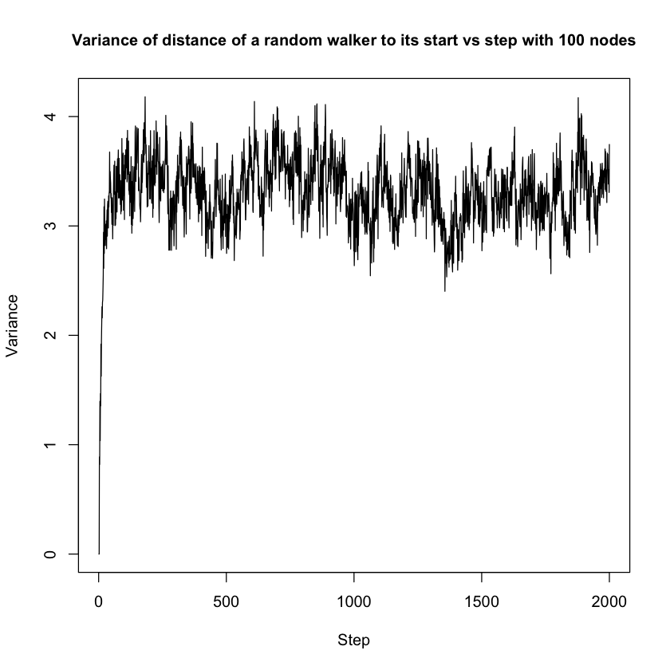
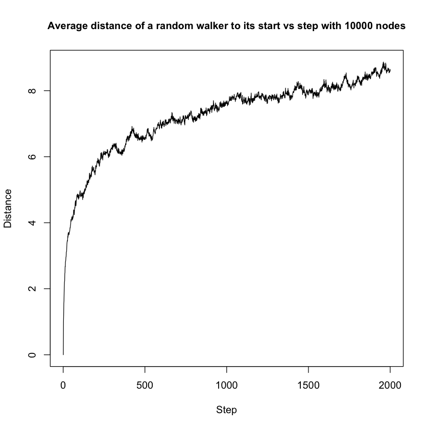
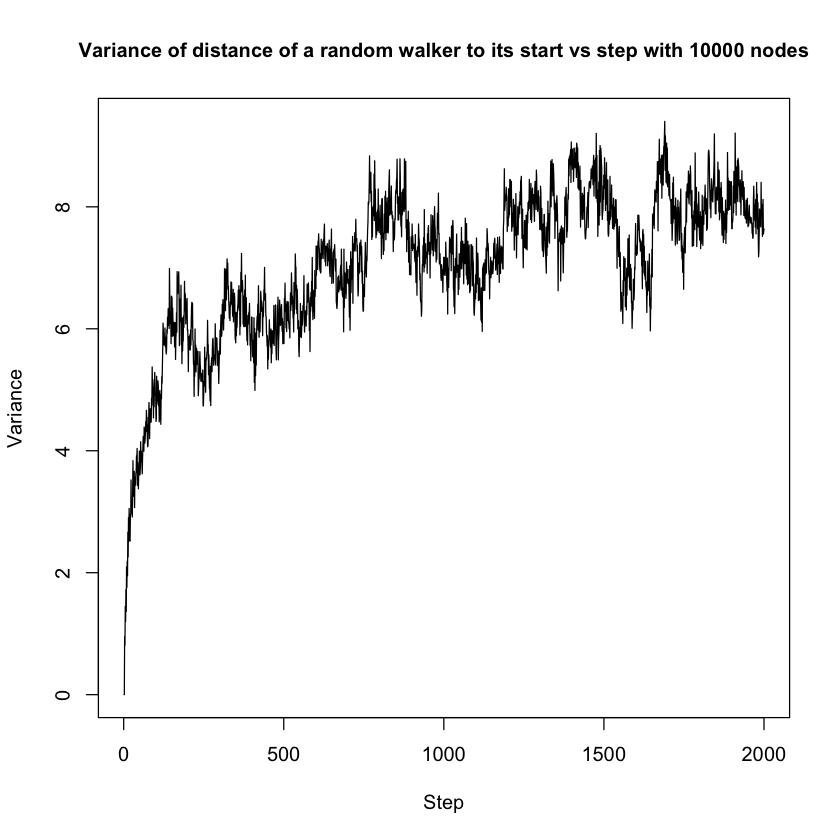

# Part 1
##Problem 1
## Problem 3
### (a)
The degree distribution of the network is as below.  
  
Fit the distribution to power law and get the result exponent is **4.68233571652074**. Details are as below.  
* continuous: FALSE  
* alpha: 4.68233571652074
* xmin: 4  
* logLik: -145.530949783814  
* KS.stat: 0.0345632541890962  
* KS.p: 0.99926736466248.  

### (b)
Use fast greedy method to find the community structure. The community sizes are: **43, 45, 45, 44, 41, 42, 42, 44, 38, 42, 33, 33, 37, 33, 34, 35, 34, 34, 30, 33, 29, 29, 27, 27, 25, 23, 21, 19, 19, 19**. And the modularity is **0.935616296977663**.

# Part 2  
## Problem 1  

## Problem 2  
### (b)  
  
  
The average distance graph seems converge around 1500 steps with the average distance about
8 while the variance graph still fluctuates even for 2000 steps.  
### (c)  
  
From this graph, it is quite clear that the degree distribution for random walk is similar to that of the original graph. 
Since random walk is like doing random sampling from the original graph, the result is in expectation.  
### (d)  
  
  
  
  
Comparing to those three sets of graphs, we can see that with higher number of nodes, the convergence will take more steps. 
The plots with number of node equal to 100, it converge quite easily, at around 300. With 1000 nodes, the curve converges at around 1700 steps. 
With 10000 nodes, the curve does not even look like converge at step 2000. With higher number of nodes, the diameter of the network is also higher. 
Therefore, the higher the diameter of a network is, the longer it will take for the average distance and the variance of distance of random walks to converge.

## Problem 3 
### (a) 
Generate the network and simulate random walk on the network. Measure the visit probability of each node and calculate the the relationship between the visit probabilty and the degree distribution. The results are as below. And we can see that the visit probability is highly related to the in-degree of the nodes.  
* Correlation between in-degree and visit probability:  **0.532488**   
* Correlation between out-degree and visit probability:  **-0.7304185**   
* Correlation between total-degree and visit probability:  **0.5299272**   
  
  
  

### (b)
Perform random walk with a teleportation probability of 0.15. The result visit probability is more distributed than the one shown in 3(a), though it's still highly related to the in-degree of the nodes.  
* Correlation between in-degree and visit probability:  **0.6149209**   
* Correlation between out-degree and visit probability:  **-0.7949347**   
* Correlation between total-degree and visit probability:  **0.6123663**   
  
  
  
