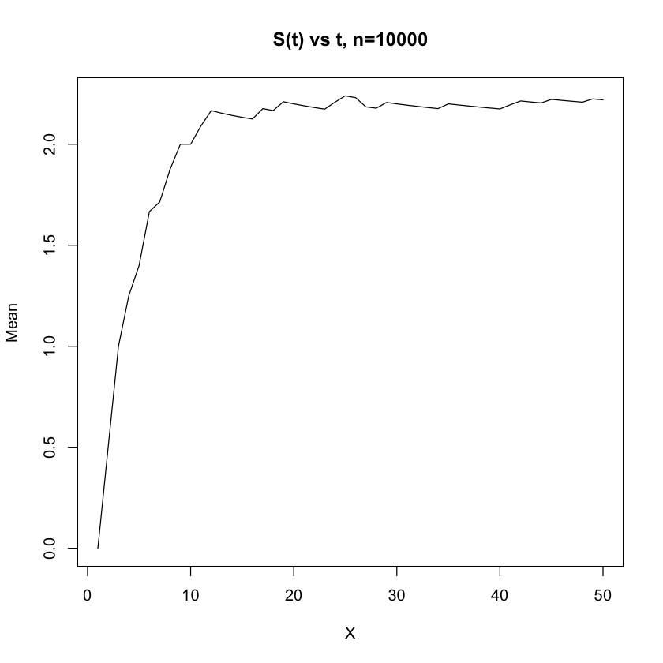
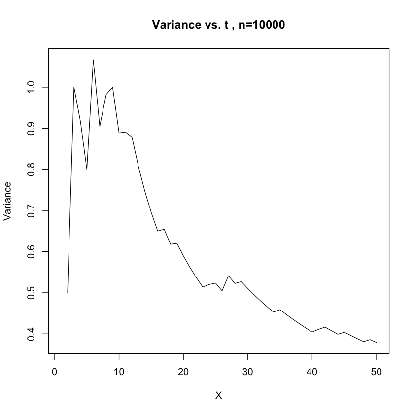

# Part 1

## Problem 2
### (a) 
By definition of preferential attachment model, the graph will always be connected since a node always choose a node  ii  with  degree(i)degree(i)  >= 1 and construct an edge with it. Therefore, the newly inserted node will always be connected with the graph.

### (b)
Modualrity is 0.9327325

### (c)
Modularity is 0.9759, It did not change dramatically since the overall graph strucutre is determined by the same generative model. The modularity increased since later generated nodes are less likely to be connected.
 
### (d)

Slope is rooughly 0.025

### (e)

The degree distribution of the subgraph is very similar to its parent graph. Since the subgraph is randomly sampled and the empirical distribution should be similar to its parent graph.

### (f)

We can tell from the graph that the number of degress is closely related to the age of nodes. This is one of the most important chracteristics of preferential attachment model. There is a spike at ages = 1000, showing that the generative model strickly favors starting nodes. 

### (g) 
### m=2

The modularity is 0.52540327767565 with n= 1000, m=2
The modularity is 0.52853133625893 with n= 10000, m=2

Modularity increases as the number of selected node per iteration increases. 
Since modularity represents the strenths of dividing network into submodules, larger m will always result in a more densly connected graph. So the modularity of m=1 is high.

#### m = 5

### (h)

Both procedures will be able to generate PA models. However, the stub matching models do
not generate edges during the construction process. Instead, it randomly matches with 
other nodes regardless of current degree

## Problem 3
### (a)
The degree distribution of the network is as below.  
  
Fit the distribution to power law and get the result exponent is **4.68233571652074**. Details are as below.  
* continuous: FALSE  
* alpha: 4.68233571652074
* xmin: 4  
* logLik: -145.530949783814  
* KS.stat: 0.0345632541890962  
* KS.p: 0.99926736466248.  

### (b)
Use fast greedy method to find the community structure. The community sizes are: **43, 45, 45, 44, 41, 42, 42, 44, 38, 42, 33, 33, 37, 33, 34, 35, 34, 34, 30, 33, 29, 29, 27, 27, 25, 23, 21, 19, 19, 19**. And the modularity is **0.935616296977663**.

# Part 2  
## Problem 1  

### (b)

We calcualted the mean and variance using a 50 step randome and 10 repeatitions per step size for variance and mean. The relationship is shown below. It seems to converge as the t grows

### (c) 

The result of random walk is very similar to the degree distribution of the graph. Since random walk depends on the structure of the orginal graph and thus has similar degree distribution

### (d)

When n = 100, with a step size of 50

When n = 1000, with a step size of 50

## Problem 2  
### (b)  
  
  
The average distance graph seems converge around 1500 steps with the average distance about
8 while the variance graph still fluctuates even for 2000 steps.  
### (c)  
  
From this graph, it is quite clear that the degree distribution for random walk is similar to that of the original graph. 
Since random walk is like doing random sampling from the original graph, the result is in expectation.  
### (d)  
  
  
  
  
Comparing to those three sets of graphs, we can see that with higher number of nodes, the convergence will take more steps. 
The plots with number of node equal to 100, it converge quite easily, at around 300. With 1000 nodes, the curve converges at around 1700 steps. 
With 10000 nodes, the curve does not even look like converge at step 2000. With higher number of nodes, the diameter of the network is also higher. 
Therefore, the higher the diameter of a network is, the longer it will take for the average distance and the variance of distance of random walks to converge.

## Problem 3 
### (a) 
Generate the network and simulate random walk on the network. Measure the visit probability of each node and calculate the the relationship between the visit probabilty and the degree distribution. The results are as below. And we can see that the visit probability is highly related to the in-degree of the nodes.  
* Correlation between in-degree and visit probability:  **0.532488**   
* Correlation between out-degree and visit probability:  **-0.7304185**   
* Correlation between total-degree and visit probability:  **0.5299272**   
  
  
  

### (b)
Perform random walk with a teleportation probability of 0.15. The result visit probability is more distributed than the one shown in 3(a), though it's still highly related to the in-degree of the nodes.  
* Correlation between in-degree and visit probability:  **0.6149209**   
* Correlation between out-degree and visit probability:  **-0.7949347**   
* Correlation between total-degree and visit probability:  **0.6123663**   
  
  
  

## Problem 4

### (a)
When using teleportation based on PageRank, random jump will favor nodes with high PageRank values. Different from the result in 3b, which uses random jump with uniform distribution over all pages, the result in this problem is more likely to land onto vertices with high page rank values, like the first few nodes.The distribution becomes more concentrated in this case due to the random jump probability being affected by initial PageRank obtained from 3b  

Correlation between in-degree and PageRank is 0.3630926 

### (b)
After setting the favorite page to two medians, the PageRank of these two pages greatly increased. Other pages PageRank decreased significantly due to the biased random jump probability.

### (c)

Let's consider the normal PageRank equation,

 $$ Pr(A) = \frac{(1 - d)}{N} + d\sum_{T_in} \frac{Pr(T_in)}{C(T_in)}$$

, where  Pr(A) is the PageRank of page  A, d is the damping factor, $N$ is the total number of pages or nodes, $T_in$ is the set of nodes which has an edge directed to $A, C(T_in)$ is the number of edges of$ T_in$.

To take into account the effect of user's self-reinforcement, we can change the teleportation probability from  $\frac{1}{N} $to a number which reflects users' interest or trust on site  A.

