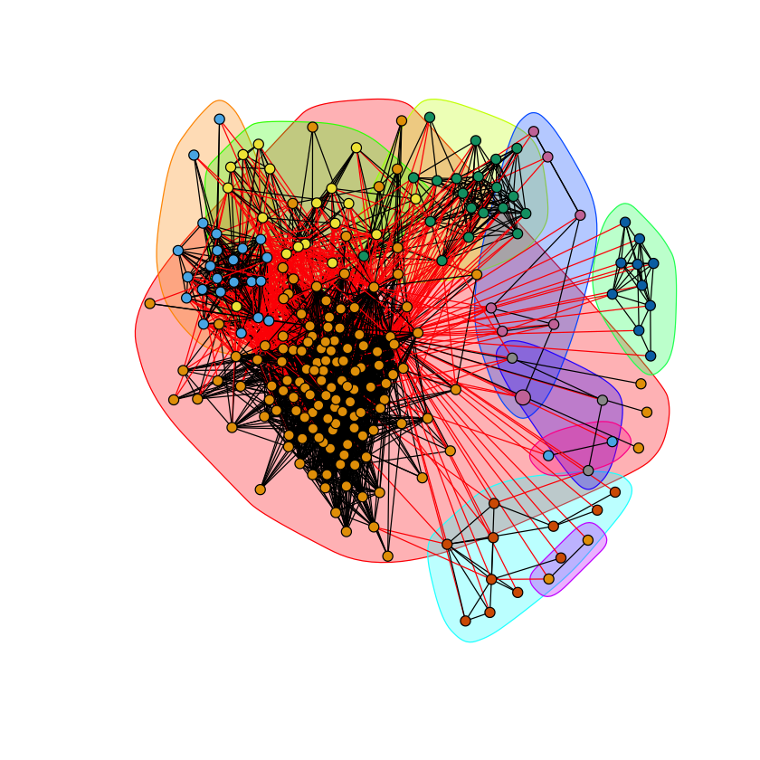
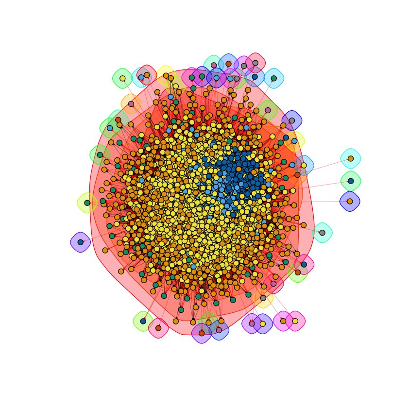

# ECE 232E Spring 2018 - Project 2

### Linzuo Li (604944917)

### Haoran Wang (505029637)

### Liang Qiu (704725636)

### Yan Huang (404759425)

# 1. Facebook network

## 1.1

### Question 1

Yes, the facebook network is connected.

### Question 2

The diameter of the network is 8.

### Question 3

The degree distribution is as follow. The average degree distribution is 43.69101.

### Question 4

The degree distribution and the fit line in a log-log scale is as follow.

The estimated slope of the fit line is $$ -1 \times 10^{-4}$$.

## 1.2

### Question 5

Number of nodes: 348

Number of edges: 2866

### Question 6

Diameter of the graph is: 2

In a personalized network, the trivial lower bound is 1, all neighbors are connected (fully connected graph). The trivial upper bound is 2, at least two neighbors of the core node is not connected. So the path between these two nodes will contain the core node, resulting a path of length 2.

### Question 7

**Upper bound = 2 :**  The person has at least two friends that do not know each other.

**Lower bound = 1 :**   The person's friends all know each other.

## 1.3.1

### Question 8

There are 40 core nodes in the Facebook network. The average degree of them is 279.375.

### Question 9

Community structure analysis using different community detection algorithms.

* ##### Node ID 1

  **Fast-Greedy modularity: ** 0.4131014

  **Edge-Betweenness modularity: ** 0.3533022

  **Infomap modularity:** 0.3891185

* ##### Node ID 108
  **Fast-Greedy Modularity:** 0.4359294

  **Edge-Betweenness:** 0.5067549

  **Infomap modularity:** 0.5082492

* ##### Node ID 349
  **Fast-Greedy Modularity:** 0.2517149

  **Edge-Betweenness:** 0.133528

  **Infomap modularity:** 0.203753

* ##### Node ID 484
  **Fast-Greedy Modularity:** 0.5070016

  **Edge-Betweenness:** 0.4890952

  **Infomap modularity:** 0.5152788

* ##### Node ID 1087
  **Fast-Greedy Modularity:** 0.1455315

  **Edge-Betweenness:** 0.02762377

  **Infomap modularity:** 0.02690662

## 1.3.2

### Question 10

Community structure analysis after removing the core node.

Comparing to the the original networks, the new networks have higher
modularity. The reason is that after removing the core nodes, the edges
that connected the community through the core nodes are now dropped. Thus, every parts of the networks are more seperated, meaning higher modularities.

* ##### Node ID 1

  **Fast-Greedy modularity: ** 0.4418533

  **Edge-Betweenness modularity: ** 0.4161461

  **Infomap modularity:** 0.4180077

* ##### Node ID 108
  **Fast-Greedy Modularity:** 0.4581271

  **Edge-Betweenness:** 0.5213216

  **Infomap modularity:** 0.5185969

* ##### Node ID 349
  **Fast-Greedy Modularity:** 0.2456918

  **Edge-Betweenness:** 0.1505663

  **Infomap modularity:** 0.2465785

* ##### Node ID 484
  **Fast-Greedy Modularity:** 0.5342142

  **Edge-Betweenness:** 0.5154413

  **Infomap modularity:** 0.5434437

* ##### Node ID 1087
  **Fast-Greedy Modularity:** 0.1481956

  **Edge-Betweenness:** 0.0324953

  **Infomap modularity:** 0.02737159

## 1.3.3

### Question 11

Given node i, the embeddedness of node i is equal to $Deg(i) - 1$. Because core node neighbors are all in the network. The neighbors of a node - 1 is the number of friends of node i except the core node.

### Question 12

During our calculation, we found that certain nodes are not connected to each other and thus an "inf" was used by igraph's distance matrix to represent a disconnected path. As a result, we replaced it with a constant value c = 5 (5 > diameter) so only numeric values are considered and disconnected path distance is taken into consideration.

The general trend is that, dispersion will increase as the number of embeddedness increases. Most of nodes tend to have few embeddedness and dispersion.  

### Question 13

We applied Fast-Greedy algorithms to find Community structure which is shown in below plots, represented by different colors. The node with maximum dispersion is highlighted with red incident edges. Core node is also enlarged for clarity. We try to change the node color to show our core node and maximum dispersion node. However, it seems that the community color seems to be overwriting our color settings for these two individual nodes. We cannot find a work around but this should not affect the graph in general.

Maximum dispersion of core:1 is ID: 57

Maximum dispersion of core:1 is ID: 1889

Maximum dispersion of core:1 is ID: 377

Maximum dispersion of core:1 is ID: 108

Maximum dispersion of core:1 is ID: 108

### Question 14

We highlighted our core node with white color. Personal network along with nodes with maximum embeddedness and dispersion/embeddedness ratio are shown in the below graph. Maximum dispersion is highlighted in red and maximum d/e ratio is highlighted in green. If the nodes share the same ID, it is highlighted with purple in this graph.

Maximum embeddedness of core:1 is ID: 57

Maximum dispersion/embeddedness ratio of core:1 is ID: 26

Maximum embeddedness of core:1 is ID: 1889

Maximum dispersion/embeddedness ratio of core:1 is ID: 1889

Maximum embeddedness of core:1 is ID: 377

Maximum dispersion/embeddedness ratio of core:1 is ID: 377

Maximum embeddedness of core:1 is ID: 108

Maximum dispersion/embeddedness ratio of core:1 is ID: 108

Maximum embeddedness of core:1 is ID: 108

Maximum dispersion/embeddedness ratio of core:1 is ID: 108

### Question 15

#### Dispersion：
From the plots we obtained, we can see that, nodes with highest dispersion is usually in the same community with the
core node. Dispersion seems to be proportional to the number embeddedness of the node, which intuitively makes since
because of the definition of embeddedness which depends on the number of mutual friends a node shares with the core node. Nodes in the same community with the core node usually shares more mutual friends with the core node resulting high dispersion.

#### Embeddeness:
By definition, embeddedness is the number of mutual friends a node shares with the core node. From the plotted graphs, we can observe that, nodes with large embeddedness always shares the same largest community with the core node.

#### Dispersion/Embeddeness:
Dispersion measures the distances between pairs of nodes without the core node and the node being calculated. A high dispersion/embeddedness ratio represents that the core node and the node of interests have mutual friends that would not be acquainted without these two nodes. So it is interesting to guess that this maximum node could have a special relationship with the core node.

## 1.4

### Question 16

The $|N_{r}|$ is 11.

### Question 17

The average accuracy of the three recommendation algorithm:

* Common Neighbors measure: 0.3927227
* Jaccard measure: 0.1457471
* Adamic Adar measure: 0.1773167

So according to my experiment results, the Common Neighbors measure is the best.

# 2. Google+ network

### Question 18

The number of personal networks are 57.

### Question 19

All those distributions show similar trends. For the outward degree distributions, all the three show that there are almost no nodes with high outward degree, for example with degree higher than 200. However, the first two have more nodes with outward degree less than 50 than that of the last one. For the inward degree distribution, the curves have the similar shapes and the only difference is the number of nodes of each graphs. The last one has more nodes than the previous two graphs.

* ##### Node ID: 109327480479767108490

* ##### Node ID: 115625564993990145546

* ##### Node ID: 101373961279443806744

## 2.1

### Question 20

The modularities of those three are different. The last one is more connected than the previous two and those two are similar, with similarity 0.184.

* ##### Node ID: 109327480479767108490
Modularity: 0.2527654

* ##### Node ID: 115625564993990145546
Modularity: 0.3128763

* ##### Node ID: 101373961279443806744
Modularity: 0.1638597

### Question 21

higher homogeneity indicates the circles in the community are of the same type; higher completeness indicates the community comprise many different types of circles

### Question 22
$h1$ is around 0.21, $c1$ is around 0.33.  
$h2$ is around 0.48, $c2$ is around -3.53.  
$h3$ is around 0.006, $c3$ is around -1.55.  
$H(C)$ indicates the chaos of circle system of the network. If the network has more numbers of circles, $H(C)$ or say the chaos is higher;
$H(k)$ indicates the chaos of community system of the network. If the network has more numbers of communities, $H(K)$ or say the chaos is higher.  
$H(C|K)$ indicate how the circles are distributed in different communities. If more people with same circle information are in the same community, $H(C|K)$ is lower.  
$H(K|C)$ indicate how the communities are distributed in different circles. If more people with same community information are in the same circle, $H(C|K)$ is lower.
