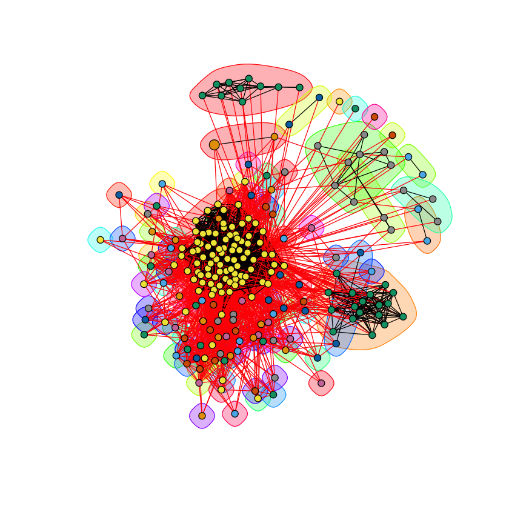

# ECE 232E Spring 2018 - Project 2

### Linzuo Li (604944917)

### Haoran Wang (505029637)

### Liang Qiu (704725636)

### Yan Huang (404759425)

# 1. Facebook network

## 1.1

### Question 1

Yes, the facebook network is connected.

### Question 2

The diameter of the network is 8.

### Question 3

The degree distribution is as follow. The average degree distribution is 43.69101.

### Question 4

The degree distribution and the fit line in a log-log scale is as follow.

The estimated slope of the fit line is $$ -1 \times 10^{-4}$$.

## 1.2

### Question 5

Number of nodes: 348

Number of edges: 2866

### Question 6

Diameter of the graph is: 2

In a personalized network, the trivial lower bound is 1, all neighbors are connected (fully connected graph). The trivial upper bound is 2, at least two neighbors of the core node is not connected. So the path between these two nodes will contain the core node, resulting a path of length 2.

### Question 7

**Upper bound = 2 :**  The person has at least two friends that do not know each other.

**Lower bound = 1 :**   The person's friends all know each other.

## 1.3

### Question 8

There are 40 core nodes in the Facebook network. The average degree of them is 279.375.

### Question 9

Community structure analysis using different community detection algorithms.

* ##### Node ID 1

  **Fast-Greedy modularity: ** 0.4131014 

  **Edge-Betweenness modularity: ** 0.3533022

  **Infomap modularity:** 0.3891185

* ##### Node ID 108
  **Fast-Greedy Modularity:** 0.4359294

  **Edge-Betweenness:** 0.5067549

  **Infomap modularity:** 0.5082492

* ##### Node ID 349
  **Fast-Greedy Modularity:** 0.2517149

  **Edge-Betweenness:** 0.133528

  **Infomap modularity:** 0.203753

* ##### Node ID 484
  **Fast-Greedy Modularity:** 0.5070016

  **Edge-Betweenness:** 0.4890952

  **Infomap modularity:** 0.5152788

* ##### Node ID 1087
  **Fast-Greedy Modularity:** 0.1455315

  **Edge-Betweenness:** 0.02762377

  **Infomap modularity:** 0.02690662

### Question 10

### Question 11

Given node i, the embeddedness of node i is equal to $Deg(i) - 1$. Because core node neighbors are all in the network. The neighbors of a node - 1 is the number of friends of node i except the core node.

### Question 12

During our calculation, we found that certain nodes are not connected to each other and thus an "inf" was used by igraph's distance matrix to represent a disconnected path. As a result, we replaced it with a constant value c = 5 (5 > diameter) so only numeric values are considered and disconnected path distance is taken into consideration.

The general trend is that, dispersion will increase as the number of embeddedness increases.

### Question 13

We applied Fast-Greedy algorithms to find Community structure which is shown in below plots, represented by different colors. The node with maximum dispersion is highlighted with red incident edges. Core node is also enlarged for clarity. We try to change the node color to show our core node and maximum dispersion node. However, it seems that the community color seems to be overwriting our color settings for these two individual nodes. We cannot find a work around but this should not affect the graph in general.

### Question 14

We highlighted our core node with white color. Personal network along with nodes with maximum embeddedness and dispersion/embeddedness ratio are shown in the below graph. Maximum dispersion is highlighted in red and maximum d/e ratio is highlighted in green. If the nodes share the same ID, it is highlighted with purple in this graph.

### Question 15

#### Dispersion：
From the plots we obtained, we can see that, nodes with highest dispersion is usually in the same community with the
core node. Dispersion seems to be proportional to the number embeddedness of the node, which intuitively makes since
because of the definition of embeddedness which depends on the number of mutual friends a node shares with the core node. Nodes in the same community with the core node usually shares more mutual friends with the core node resulting high dispersion.

#### Embeddeness:
By definition, embeddedness is the number of mutual friends a node shares with the core node. From the plotted graphs, we can observe that, nodes with large embeddedness always shares the same largest community with the core node.

#### Dispersion/Embeddeness:
Dispersion measures the distances between pairs of nodes without the core node and the node being calculated. A high dispersion/embeddedness ratio represents that the core node and the node of interests have mutual friends that would not be acquainted without these two nodes. So it is interesting to guess that this maximum node could have a special relationship with the core node.

## 1.4

### Question 16

The $$ |N_{r}|$$ is 11.

### Question 17

The average accuracy of the three recommendation algorithm:

* Common Neighbors measure: 0.3927227
* Jaccard measure: 0.1457471
* Adamic Adar measure: 0.1773167

So according to my experiment results, the Common Neighbors measure is the best.

# 2. Google+ network

### Question 18

### Question 19

### Question 20

### Question 21

### Question 22
