# ECE 232E Spring 2018 - Project 3

### Linzuo Li (604944917)

### Haoran Wang (505029637)

### Liang Qiu (704725636)

### Yan Huang (404759425)

# 1. Reinforcement learning

## Question 1

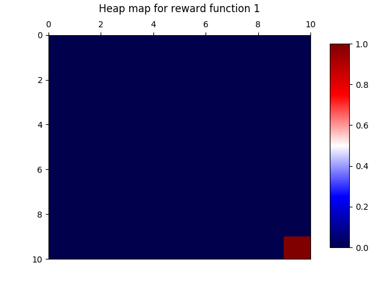

## Question 2

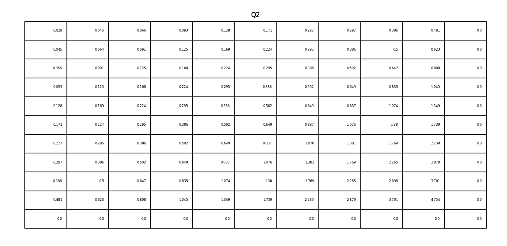

## Question 3

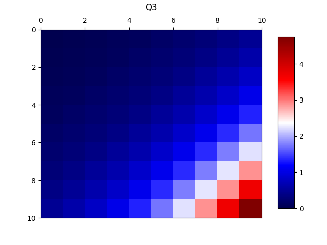

## Question 4
According to the plot from question 3, the closer a state is to the bottom right state, the higher the optimal value of that state is. Since the bottom right corner, from reward function 1, has the biggest reward comparing to all the other states, it is quite obvious that each state value, from that corner to the other three, should decrease gradually as going further from the bottom right.  
## Question 5

The plot clearly shows that the optimal policy is to get to the bottom right, which has the highest reward. 

[comment]: # (It could be possible to get the optimal action by only observing the neighbor. Based on the RL algorithm, the optimal value of the neighbors already refect the maximum value considering their neighbors. Therefore, the state value of its neighbors fully illustrate the optimal value from the whole state set.)

## Question 6
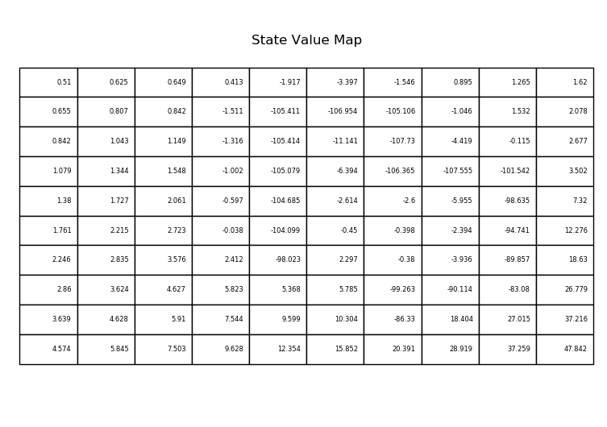
State values shows a good reflection of the given reward function where the penalty is very high at the center. And state value gets closer as it move closer to the bottom right corner.
## Question 7
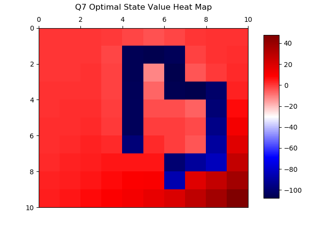
## Question 8
The distribution of state values shows a good reflection of the given reward function where the penalty is very high at the center. And state value gets closer as it move closer to the bottom left corner. As a state get closer to bottom right, its value increases since the reward is high at the bottom right.
## Question 9
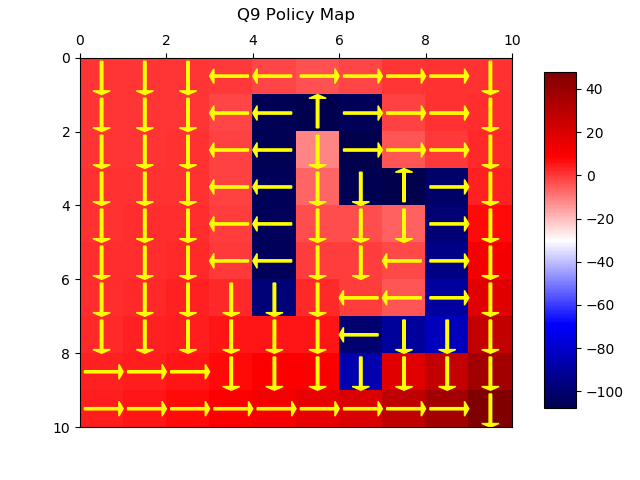

The optmial policy of this agent matches our intuition since it wants to avoid the center areas and has a general trend of moving to bottom right corner of the grid. At the end, it tries to stay in the corner by moving out of the grid.
# 2. Inverse Reinforcement learning

## Question 11

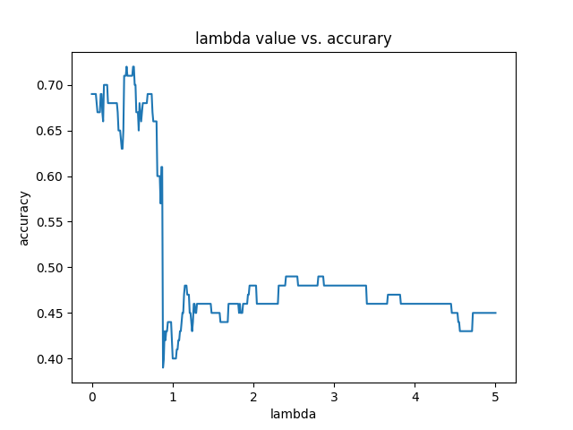

## Question 12

$\lambda_{max} \approx 0.431$

## Question 13

### Ground Truth

### Extracted Reward
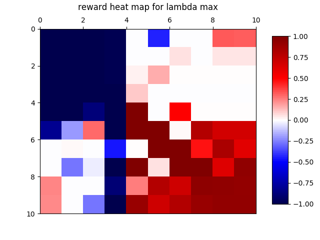

## Question 14

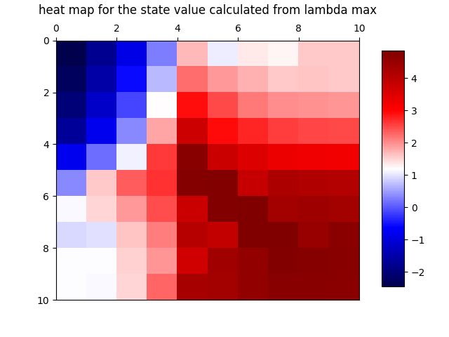

## Question 15

The most part of the two plots are the same. The all have the minimum reward 0 and the maximum reward 1. The only difference between those two plots are at the bottom right corner. For the ground truth reward, in this case reward function 1, there is only one state with positive reward, which is the bottom right corner. However, for the learned reward, although the reward for the bottom right corner is the same, its two neighbors have positive reward. 

## Question 16

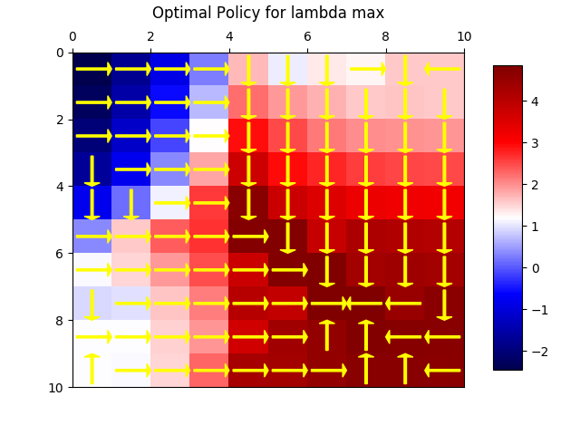

## Question 17
### Ground Truth

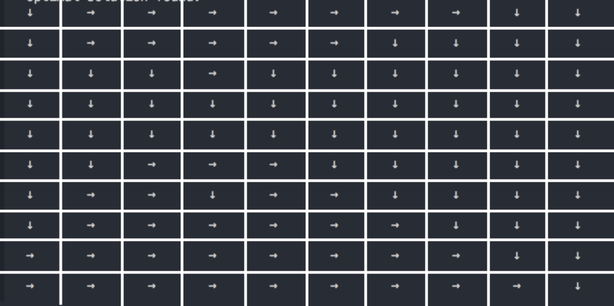
Those two policy graphs are almost the same with slight difference. State 33, 34, 36 and 42 the origin optimal policy suggests turning right, but the learned policy suggests turing down. 

## Question 18
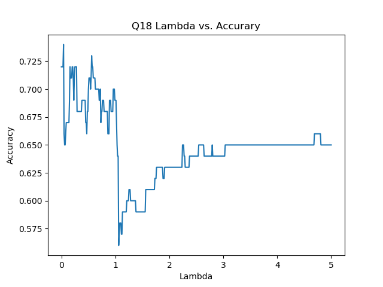

## Question 19

From the graph, we c·an see that lambda associated with maximum accuracy is  0.0400 and the accuray value is 0.74. The plot shows that there is a global minimum when the l1 regularization term is around 1.05. The relationship between lambda and accuracy is not linear or resembles any low degree polynomials.

## Question 20
### Extracted Reward
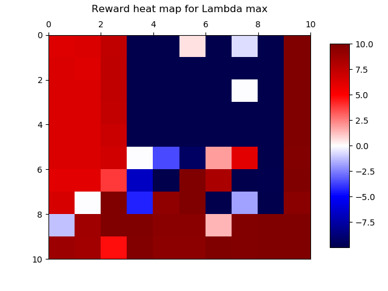
### Ground Truth
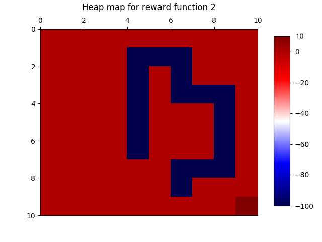

Unlike extracted reward from function 1, the extracted reward is not very consistant with its corresponding ground truth.

## Question 21
### Extracted State Value
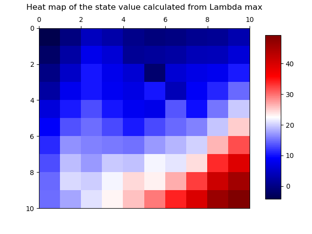
### Ground Truth
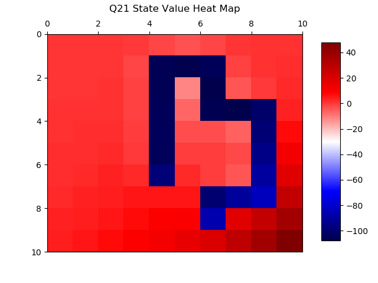

The state value heat map also shows some sort of discrepency between the ground truth value heat map and extracted heat map. The optimal policy represents the ground truth's preference of a particular action over others. In essence, it represents a relative measure and not absolute value difference. Thus, it is very hard for IRL to generate an ideal policy due to a few huge negative rewards in the original reward functions. 

## Question 22

In the orginal settings, there are a few states with very low rewards (-100) and compare with other states with 0 or 10 as rewards. There is a huge difference between rewards. For each state, the expert policy represents the ground truth's preference of a particular action over others. In essence, it represents a relative measure and not absolute value difference. Thus, it is very hard for IRL to generate an ideal policy due to a few huge negative rewards in the original reward functions. 

## Question 23
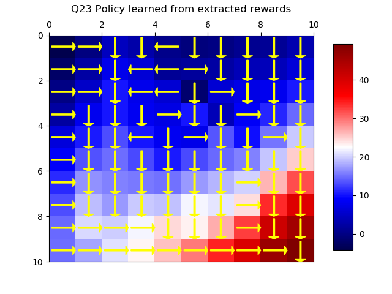

## Question 24

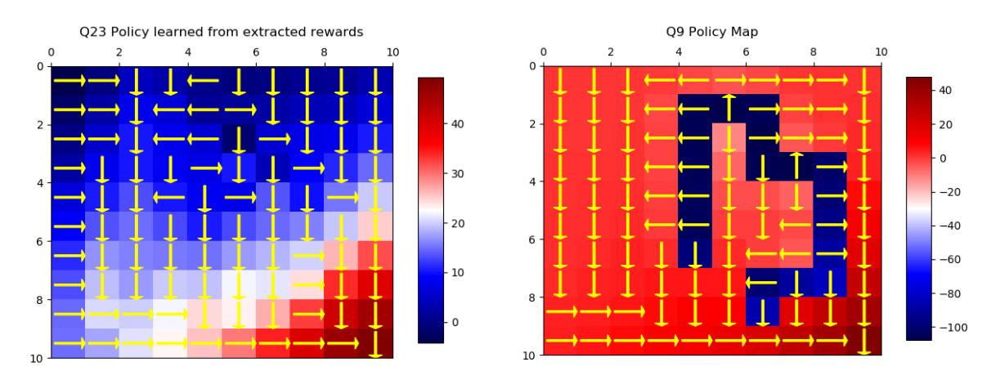
As we can see, the general trend is still reaching for the reward at the bottom right corner. However, there is a discrepency. Both the learned policy and ground truth policy has outward actions to avoid going into the center rewards with penalty policy. However, the learned state value functions cannot represent the large penalties represented in original reward function from the ground truth policy.

## Question 25
From the learned policy, we can see one of the discrepancy is that the negative reward is at the center top of the grid. Which is different from the ground truth reward function.

In order to improve the accuracy, we changed our value iteration alogrithm so that V is initialized to the given reward function so th

Improved Accuracy
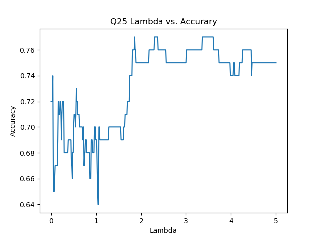
Newly Learned optimal policy map
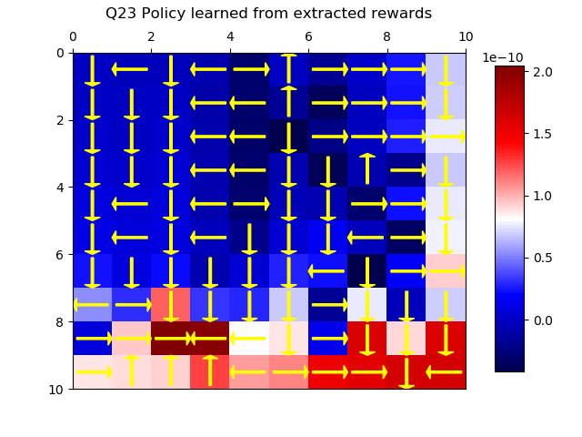

