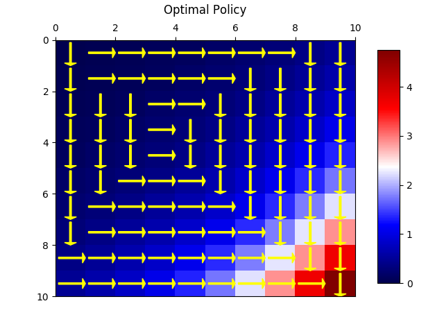

# ECE 232E Spring 2018 - Project 3

### Linzuo Li (604944917)

### Haoran Wang (505029637)

### Liang Qiu (704725636)

### Yan Huang (404759425)

# 1. Reinforcement learning

## Question 1

## Question 2

## Question 3

## Question 4
According to the plot from question 3, the closer a state is to the bottom right state, the higher the optimal value of that state is. Since the bottom right corner, from reward function 1, has the biggest reward comparing to all the other states, it is quite obvious that each state value, from that corner to the other three, should decrease gradually as going further from the bottom right.  
## Question 5

The plot clearly shows that the optimal policy is to get to the bottom right, which has the highest reward. 

It might not be possible to get the optimal action by only observing the neighbor. Although the optimal value of the neighbors already refect the maximum value considering their neighbors, the transition probability of each states should be considered. The best policy should calculate the expected value of each neighbor rather than look at the state value sheer.

## Question 6

State values shows a good reflection of the given reward function where the penalty is very high at the center. And state value gets closer as it move closer to the bottom right corner.
## Question 7

## Question 8
The distribution of state values shows a good reflection of the given reward function where the penalty is very high at the center. And state value gets closer as it move closer to the bottom left corner. As a state get closer to bottom right, its value increases since the reward is high at the bottom right.
## Question 9

The optmial policy of this agent matches our intuition since it wants to avoid the center areas and has a general trend of moving to bottom right corner of the grid. At the end, it tries to stay in the corner by moving out of the grid.
# 2. Inverse Reinforcement learning
## Question 10

Since the optimization problem is to maxmize the objective function and satisfy a few equality/inequality constraints, we wil write the optimization problem in the form of LP.

\begin{subequations}
	\begin{align}
	\max_\limits{x} &\quad  c^T x \nonumber\\
	\mbox{s.t.}~~~& Dx \leq 0 \nonumber
	\end{align}
\end{subequations}
where $c$ is a vector and $D$ is a matrix. Since the original optimization problem has a constraint $|R| \leq R_{max}$, which cannot be transformed to the form of $Dx \leq 0$, an additional element $1$ vector will be added in optimized variable $x$. However, it should be noted that in Python LP solver, the general form of the LP contains the constraint $x \leq C$ where C is a constant, such an additional element is not necessary. 

Let $x=[x_1;x_2;x_3;1]^T=[R; t; u; 1]^T$ where $R, t, u, 1$ are all $|S| \times 1$ vectors. We first write the objective function and the constraints in the matrix form and then change it to the form of $Dx\leq 0$.

For example, $c^Tx=[0~1~ -\lambda~ 0][R;t;u;1]^T$.

The first constraint $t-(P_{a_1}-P_a)(I-\gamma P_{a_1})^{-1}R \leq 0$ can be written as $x_2 -Ax_1 \leq 0 \rightarrow [-A~1~0~0][x_1;x_2;x_3;1]^T\leq 0$ 	where $A$ is matrix $(P_{a_1}-P_a)(I-\gamma P_{a_1})^{-1}$.

The second constraint $-(P_{a_1}-P_a)(I-\gamma P_{a_1})^{-1}R \leq 0$ can be written as $-Bx_1 \leq 0 \rightarrow [-B~0~0~0][x_1;x_2;x_3;1]^T\leq 0$ 	where $B$ is matrix $(P_{a_1}-P_a)(I-\gamma P_{a_1})^{-1}$.

The third constraint $-u \leq R \leq u$ can be written as $-x_3 \leq x_1$ and $x_1 \leq x_3$, which can be changed to $[-1~0~-1~0][x_1;x_2;x_3;1]^T \leq 0$ and $[1~0~-1~0][x_1;x_2;x_3;1]^T \leq 0$

The last one is $-R_{max}\leq R \leq R_{max}$, which can be written as 
$[-1~0~0~-R_{max}][x_1;x_2;x_3;1]^T \leq 0$ and $[1~0~0~-R_{max}][x_1;x_2;x_3;1]^T \leq 0$

Therefore, The optimization problem is formulated with $c^T=[0;1;-\lambda; 0]$, \\$D= 	\left[ {\begin{array}{*{20}c}
	-&A \quad &I\quad &0 ~\quad &0\\
	-&B \quad &0\quad &0 ~\quad &0\\
	-&I \quad &0 \quad -&I \quad&0\\
	&I \quad &0 \quad -&I \quad&0\\
	-&I \quad &0 \quad &0 \quad&-R_{max}I\\
	&I \quad &0 \quad &0 \quad &-R_{max}I
	\end{array}} \right]$\\
where $A$ and $B$ are matrix $(P_{a_1}-P_a)(I-\gamma P_{a_1})^{-1}$. $I$ is identity matrix.

Additionally, in Python,  Linear programs can be specified via the solvers.lp() function. 

## Question 11

## Question 12

$\lambda_{max} \approx 0.431$

## Question 13

### Ground Truth

### Extracted Reward

## Question 14

## Question 15
### Ground Truth

The two graphs look quite different. The original state value graph has a huge area of low value, while the extracted state value graph has a huge area of high value. Also, the lowest state value is 0 while the lowest at the new graph is below -2. However, they share the same trend. The top left corners of both graph have the lowest state value and the value increase across the diagonal. And the graphs look symmetric around their diagonals. 

## Question 16

## Question 17
### Ground Truth

Those two policy graphs are almost the same with slight difference. State 33, 34, 36 and 42 the origin optimal policy suggests turning right, but the learned policy suggests turing down. 

## Question 18

## Question 19

From the graph, we c·an see that lambda associated with maximum accuracy is  0.0400 and the accuray value is 0.74. The plot shows that there is a global minimum when the l1 regularization term is around 1.05. The relationship between lambda and accuracy is not linear or resembles any low degree polynomials.

## Question 20
### Extracted Reward

### Ground Truth

Unlike extracted reward from function 1, the extracted reward is not very consistant with its corresponding ground truth.

## Question 21
### Extracted State Value

### Ground Truth

The state value heat map also shows some sort of discrepency between the ground truth value heat map and extracted heat map. The optimal policy represents the ground truth's preference of a particular action over others. In essence, it represents a relative measure and not absolute value difference. Thus, it is very hard for IRL to generate an ideal policy due to a few huge negative rewards in the original reward functions. 

## Question 22

In the orginal settings, there are a few states with very low rewards (-100) and compare with other states with 0 or 10 as rewards. There is a huge difference between rewards. For each state, the expert policy represents the ground truth's preference of a particular action over others. In essence, it represents a relative measure and not absolute value difference. Thus, it is very hard for IRL to generate an ideal policy due to a few huge negative rewards in the original reward functions. 

## Question 23

## Question 24

As we can see, the general trend is still reaching for the reward at the bottom right corner. However, there is a discrepency. Both the learned policy and ground truth policy has outward actions to avoid going into the center rewards with penalty policy. However, the learned state value functions cannot represent the large penalties represented in original reward function from the ground truth policy.

## Question 25
From the learned policy, we can see one of the discrepancy is that the negative reward is at the center top of the grid. Which is different from the ground truth reward function. We think the reason is that value iteration should reflect the reward value and thus reward value should be a good indication of state value functions learned later. As a result, we slightly changed our value iteration function by initializing the value function with the learned reward function. 

In order to improve the accuracy, we changed our value iteration alogrithm so that V is initialized to the given reward function.

Improved Accuracy

Newly Learned optimal policy map

