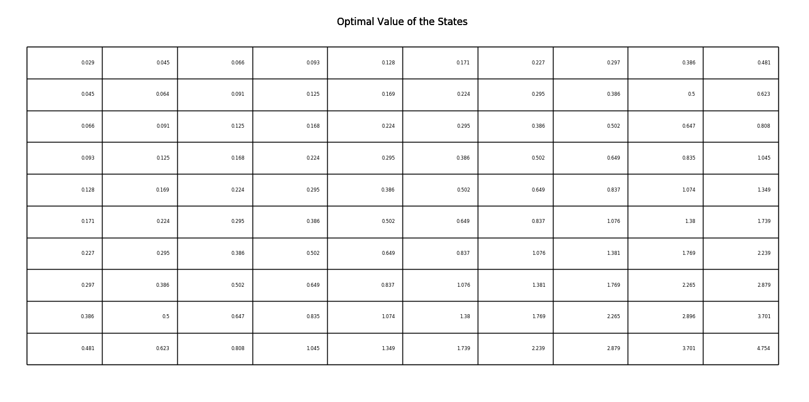
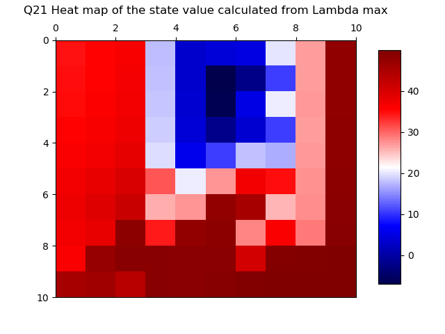

# ECE 232E Spring 2018 - Project 3

### Linzuo Li (604944917)

### Haoran Wang (505029637)

### Liang Qiu (704725636)

### Yan Huang (404759425)

# 1. Reinforcement learning

## Question 1

## Question 2

## Question 3

## Question 4
According to the plot from question 3, the closer a state is to the bottom right state, the higher the optimal value of that state is. Since the bottom right corner, from reward function 1, has the biggest reward comparing to all the other states, it is quite obvious that each state value, from that corner to the other three, should decrease gradually as going further from the bottom right.  
## Question 5

The plot clearly shows that the optimal policy is to get to the bottom right, which has the highest reward. 

[comment]: # (It might not be possible to get the optimal action by only observing the neighbor.)

## Question 6

# 2. Inverse Reinforcement learning

## Question 18

## Question 19

From the graph, we can see that lambda associated with maximum accuracy is  0.8917 and the accuray value is 0.61. The plot shows that there is a global minimum when the l1 regularization term is around 1.5. The relationship between lambda and accuracy is not linear or resembles any low degree polynomials.

## Question 20
### Extracted Reward

### Ground Truth

Unlike extracted reward from function 1, the extracted reward is not very consistant with its corresponding ground truth.

## Question 21
### Extracted State Value

### Ground Truth

The state value heat map also shows some sort of discrepency between the ground truth value heat map and extracted heat map. The optimal policy represents the ground truth's preference of a particular action over others. In essence, it represents a relative measure and not absolute value difference. Thus, it is very hard for IRL to generate an ideal policy due to a few huge negative rewards in the original reward functions. 

## Question 22

In the orginal settings, there are a few states with very low rewards (-100) and compare with other states with 0 or 10 as rewards. There is a huge difference between rewards. For each state, the expert policy represents the ground truth's preference of a particular action over others. In essence, it represents a relative measure and not absolute value difference. Thus, it is very hard for IRL to generate an ideal policy due to a few huge negative rewards in the original reward functions. 

## Question 23

