# ECE 232E Spring 2018 - Project 4

### Linzuo Li (604944917)

### Haoran Wang (505029637)

### Liang Qiu (704725636)

### Yan Huang (404759425)

# 1. Actor/Actress network

### Question 1

## 1.1 Directed actor/actress network creation

### Question 2

## 1.2 Actor pairings

### Question 3

Below we report the actor pairs and the weight for each pair. The actor pairs make sense.

* Tom Cruise - Nicole Kidman: 0.174603
* Emma Watson (II) - Daniel Radcliffe: 0.52
* George Clooney - Matt Damon: 0.119403
* Tom Hanks - Tim Allen (I): 0.101266
* Dwayne Johnson (I) - Steve Austin (IV): 0.205128
* Johnny Depp - Helena Bonham Carter: 0.081633
* Will Smith (I) - Darrell Foster: 0.102041
* Meryl Streep - Robert De Niro: 0.061856
* Leonardo DiCaprio - Martin Scorsese: 0.102041
* Brad Pitt - George Clooney: 0.098592

## 1.3 Actor rankings

### Question 4

Below we report the top 10 actors/actresses.

##### Name: number of movies, in-degree#####

Bess Flowers: 21023, 14922  
Sam Harris (II): 15467, 13702  
Harold Miller (I): 14563, 12922    
Fred Tatasciore: 10860, 7596  
Ron Jeremy: 16630, 5648  
Steve Blum (IX): 12472, 6418  
Jeffrey Sayre: 11108, 11982  
Kenner G. Kemp: 10815, 12104   
Franklyn Farnum: 14391, 11938   
Yuri Lowenthal: 9899, 5200  

No, none of them is listed in the previous section. Because most of them are senior actors/actresses and they acted in so many influential movies. People in our decade may not be familiar with them.

### Question 5

Below we report the actors/actresses in the Question 3.

##### Name: pagerank score, number of movies, in-degree 
Tom Cruise: 1.618891e-05, 1712, 1974  
Emma Watson (II): 1.692606e-05, 943, 866  
George Clooney: 2.754246e-05, 1887, 3060  
Tom Hanks: 3.426885e-05, 2101, 4014  
Eddie Johnson (I): 1.120852e-05, 309, 1070  
Johnny Depp: 3.393277e-05, 3132, 4152   
Will Smith (I): 2.457424e-05, 1249, 2460  
Meryl Streep: 2.483367e-05, 2826, 3082  
Leonardo DiCaprio: 2.469046e-05, 1345, 2532  
Brad Pitt: 2.953705e-05, 1786, 3406  

# 2. Movie network

## 2.1 Undirected movie network creation

### Question 6

## 2.2 Communities in the movie network

### Question 6

### Question 7

1.
    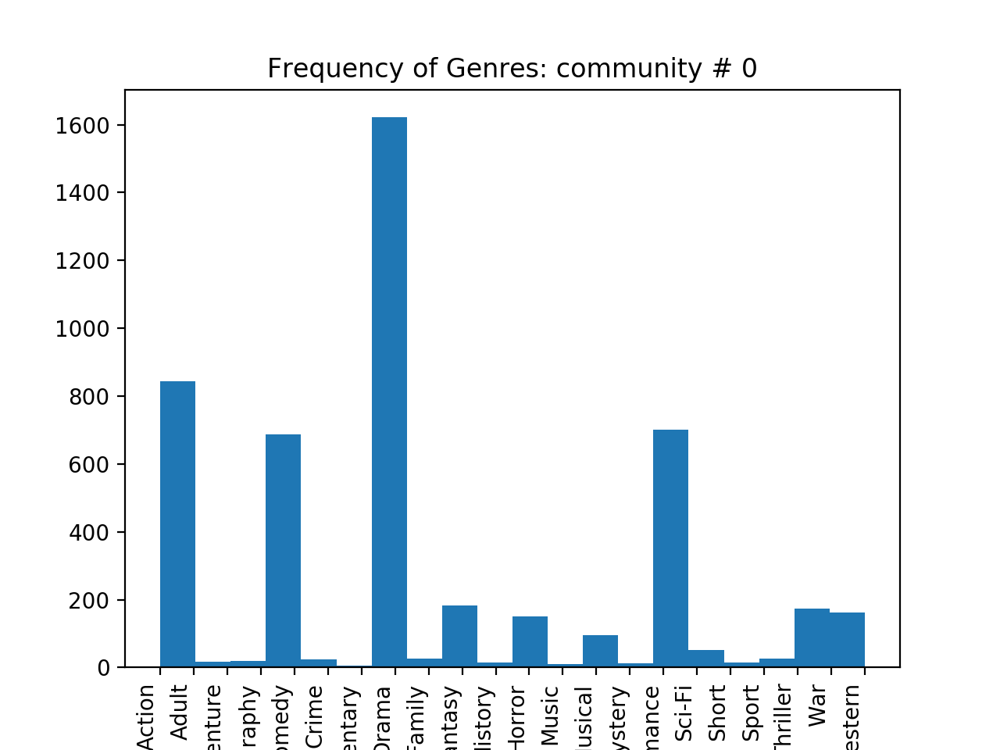
    The most dominant genre in this community is Drama

2.
    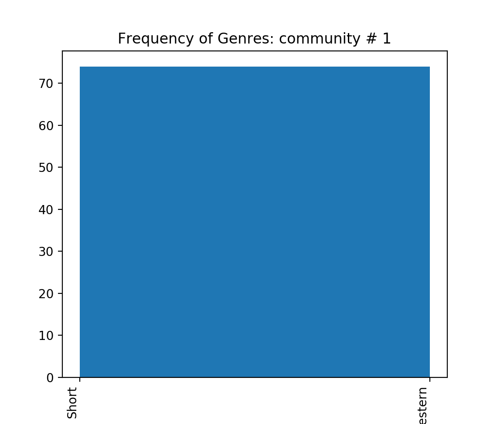
    The most dominant genre in this community is Short
3.
    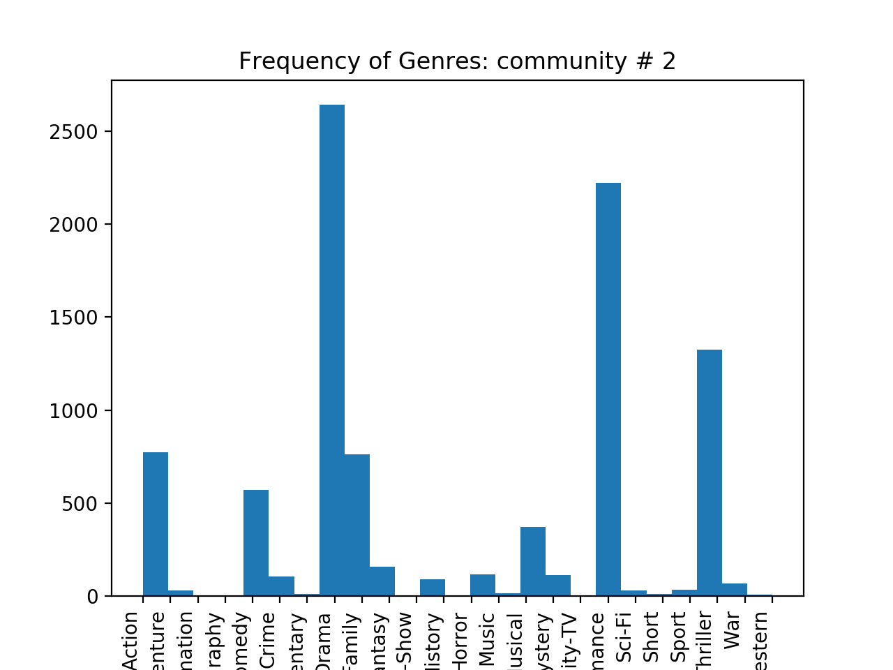
    The most dominant genre in this community is Documentary
4.
    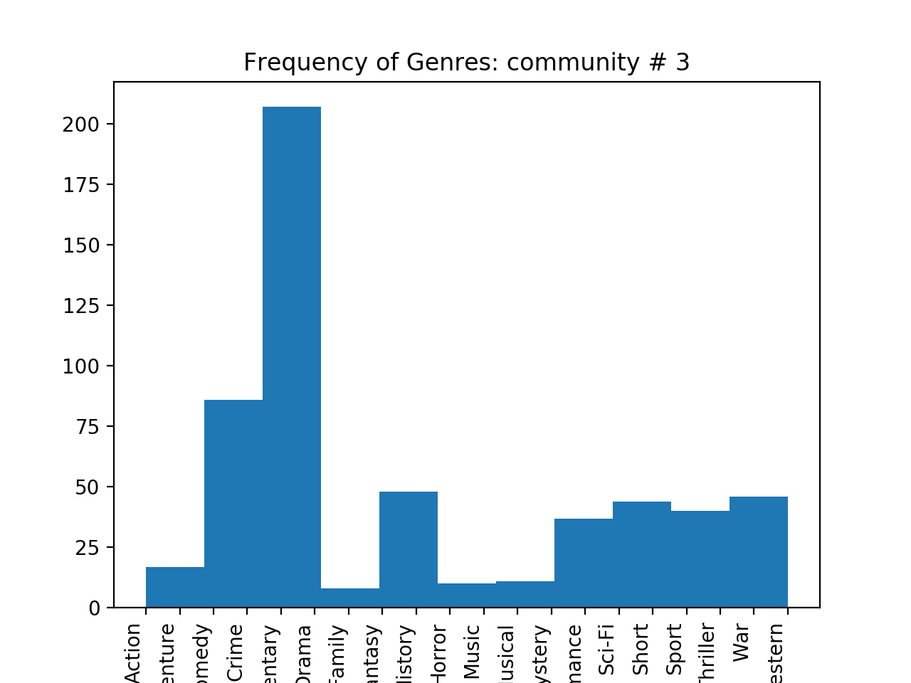
    The most dominant genre in this community is Drama and Documentary
5.
    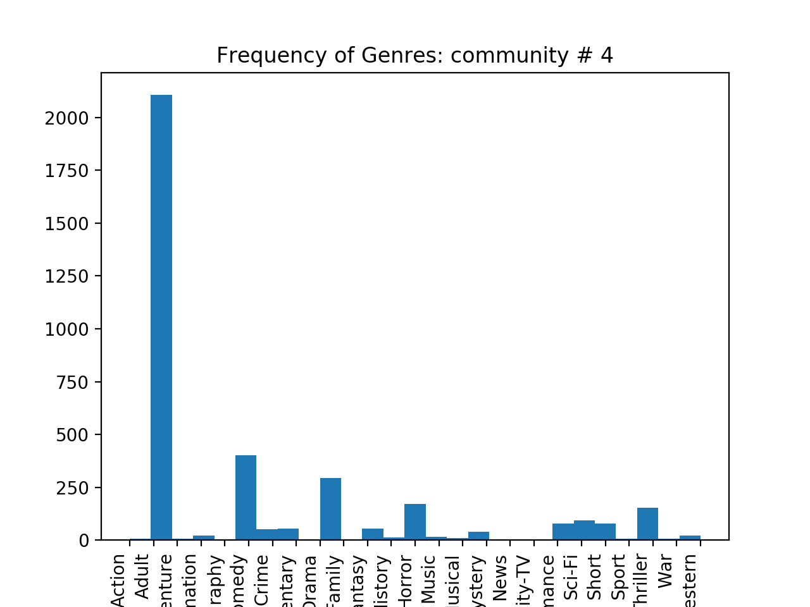
    The most dominant genre in this community is Adult
6.
    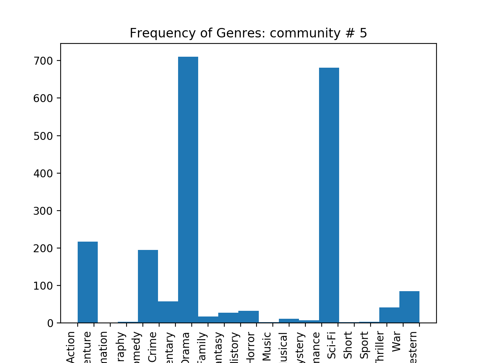
    The most dominant genre in this community is Documentary
7.
    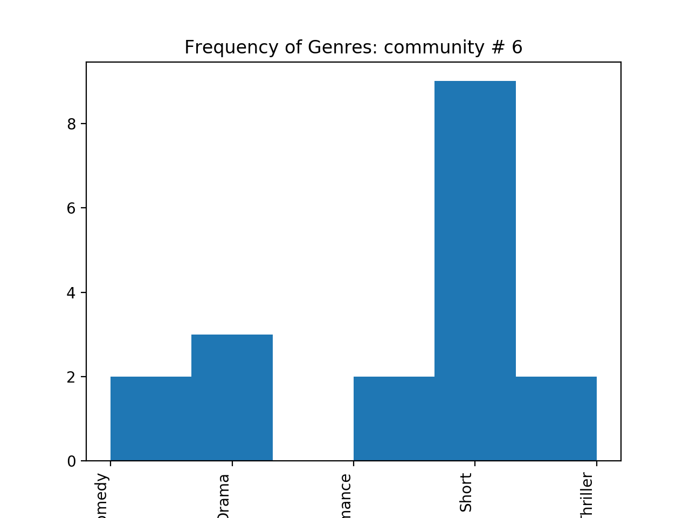
    The most dominant genre in this community is Short
8.
    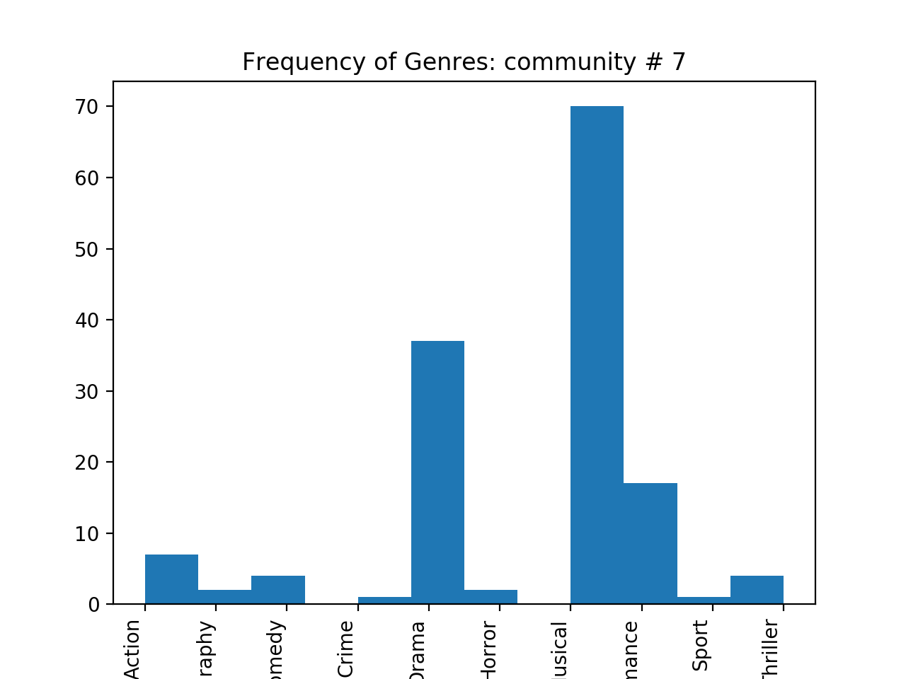
    The most dominant genre in this community is Musical
9.
    
    The most dominant genre in this community is Short
10.
    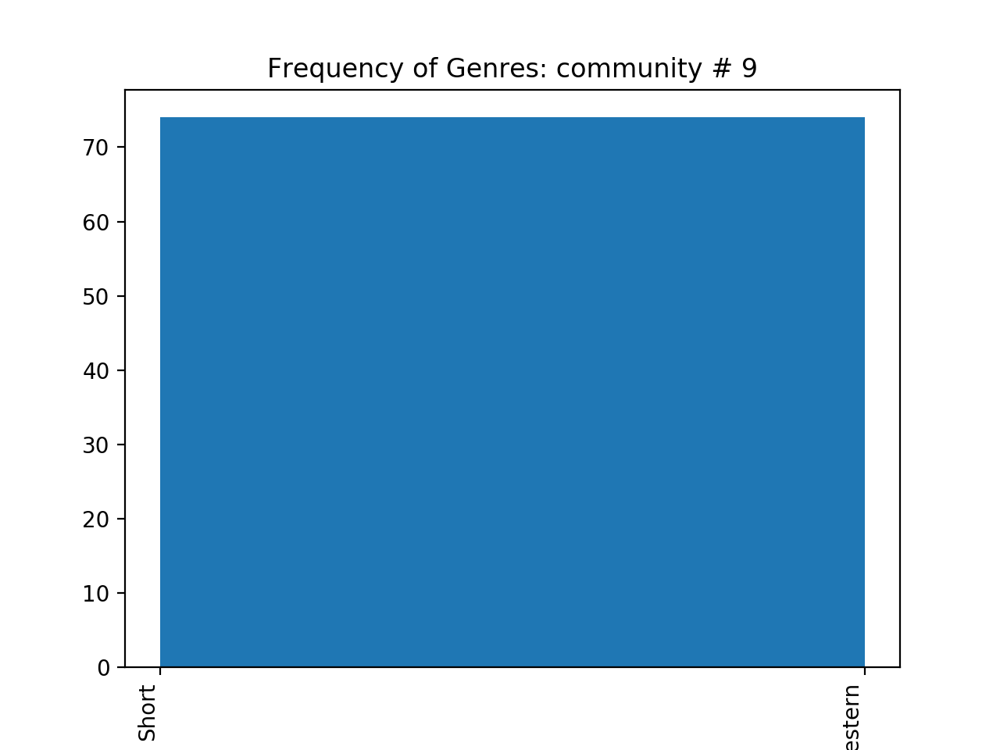
    The most dominant genre in this community is Short
### Question 8

#### (a)
1. **Drama**
2. **Short**
3. **Documentary**
4. **Drama and Documentary**
5. **Adult**
6. **Documentary**
7. **Short**
8. **Musical**
9. **Short**
10. **Short**

The most dominant genre out of these 10 communities is Drama.
#### (b)

1. **Family**, score: 43.70
2. **Short**, score: 9.53
3. **Romance**, score: 58.36
4. **History**, score: 28.22
5. **Adult**, score: 69.64
6. **Adventure**, score: 75.70
7. **Romance**, score: 2.49
8. **Musical**, score: 248.8
9. **Short**, score: 5.59
10. **Short**, score: 9.54

The most dominant genre calculated using the scoring function are different from the most frequenty genre by coount. The reason is that, the normalization used in the scoring function removes the bias. For exmple, Drama is usually a very dominant genre. So many movies in the community have the same Drama genre. Therefore, it is not intuitive to compare the count directly. So the scoring function is a better indication of the dominant genre since the frequency is normalized. 

#### (c)
 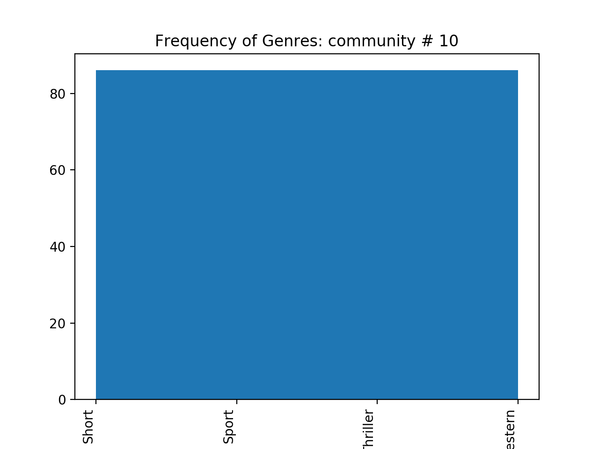
    In terms of frequency, the four genre share the same count. The most dominant genre in this community is Short and the score is 8.48

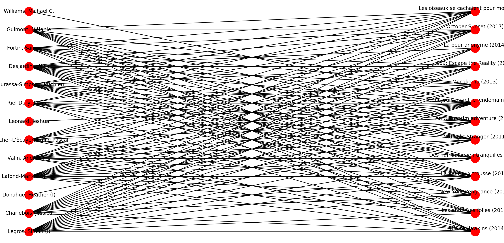

## 2.3 Neighborhood analysis of movies

### Question 9

### Question 10

### Question 11

## 2.4 Predicting ratings of movies

### Question 12

### Question 13