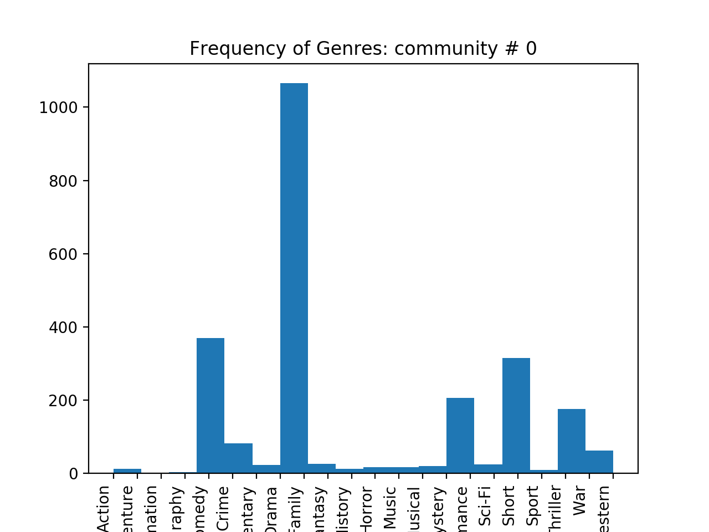

# ECE 232E Spring 2018 - Project 4

### Linzuo Li (604944917)

### Haoran Wang (505029637)

### Liang Qiu (704725636)

### Yan Huang (404759425)

# 1. Actor/Actress network

### Question 1

## 1.1 Directed actor/actress network creation

### Question 2

## 1.2 Actor pairings

### Question 3

## 1.3 Actor rankings

### Question 4

### Question 5

# 2. Movie network

## 2.1 Undirected movie network creation

### Question 6

## 2.2 Communities in the movie network

### Question 6

### Question 7

1.
    
    The most dominant genre in this community is Drama

2.
    
    The most dominant genre in this community is Short
3.
    
    The most dominant genre in this community is Documentary
4.
    
    The most dominant genre in this community is Drama and Documentary
5.
    
    The most dominant genre in this community is Adult
6.
    
    The most dominant genre in this community is Documentary
7.
    
    The most dominant genre in this community is Short
8.
    
    The most dominant genre in this community is Musical
9.
    
    The most dominant genre in this community is Short
10.
    
    The most dominant genre in this community is Short
### Question 8

#### (a)
1. **Drama**
2. **Short**
3. **Documentary**
4. **Drama and Documentary**
5. **Adult**
6. **Documentary**
7. **Short**
8. **Musical**
9. **Short**
10. **Short**

The most dominant genre out of these 10 communities is Drama.
#### (b)

1. **Family**, score: 43.70
2. **Short**, score: 9.53
3. **Romance**, score: 58.36
4. **History**, score: 28.22
5. **Adult**, score: 69.64
6. **Adventure**, score: 75.70
7. **Romance**, score: 2.49
8. **Musical**, score: 248.8
9. **Short**, score: 5.59
10. **Short**, score: 9.54

The most dominant genre calculated using the scoring function are different from the most frequenty genre by coount. The reason is that, the normalization used in the scoring function removes the bias. For exmple, Drama is usually a very dominant genre. So many movies in the community have the same Drama genre. Therefore, it is not intuitive to compare the count directly. So the scoring function is a better indication of the dominant genre since the frequency is normalized. 

#### (c)
 
    In terms of frequency, the four genre share the same count. The most dominant genre in this community is Short and the score is 8.48

## 2.3 Neighborhood analysis of movies

### Question 9

### Question 10

### Question 11

## 2.4 Predicting ratings of movies

### Question 12

### Question 13