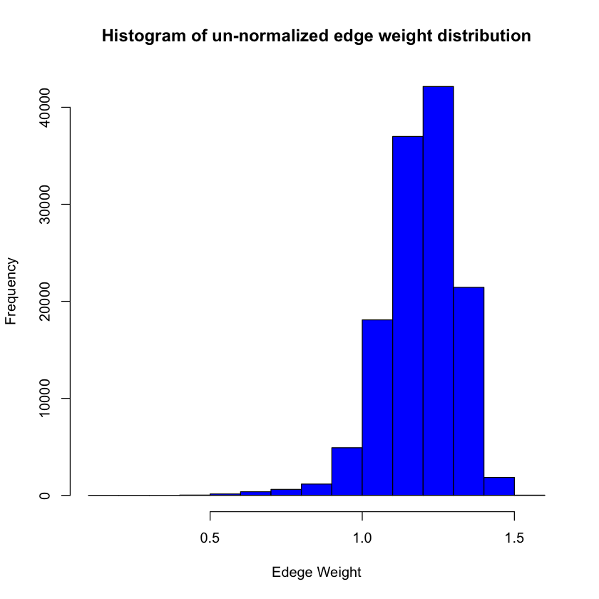

# ECE 232E Spring 2018 - Project 5

### Linzuo Li (604944917)

### Haoran Wang (505029637)

### Liang Qiu (704725636)

### Yan Huang (404759425)

# 1. Stock Market 

## 1.1 Return correlation

### Question 1

$|p_{ij}| \leq 1$

This can be proved using Cauchy-Schwarz Inequality, According to the inequality, we have 
$$
|cov(X,Y)| \leq \sigma(X)\sigma(Y) 
$$
We are given
$$
p_{ij} = \frac{<r_ir_j>-<r_i><r_j>}{\sqrt{(<r_i^2> - {<r_i>}^2)(<r_j^2> - {<r_j>}^2)}}
$$
The numerator is:
$$
<r_ir_j>-<r_i><r_j> = cov(r_i, r_j)
$$
The denominator is:

$$
\sqrt{(<r_i^2> - {<r_i>}^2)(<r_j^2> - {<r_j>}^2)} = \sigma(r_i)\sigma(r_j)
$$

Therefore, we can see that $|p_{ij}| \leq 1$ so $|p_{ij}|$ has an upper bound of 1 and lower bound of -1

The use of Log normalization term removed the denominator $p_i(t − 1)$ so the log-normalized return is only related to the ratio of price at these two different period. In addtion, using log provides a effect of diminishing return by reducing the magnitude of large values and kept the range of $r_i$ > 0.

## 1.2 Return correlation

### Question 2

Because $|p_ij|$ <= 1, the edge weight has a range between 0 and 2. From the above degree distribution plot, we can see that most of the edges has a weight of 1~1.5.  
## 1.3 Minimum Spinning Tree

### Question 3

From the plot of the vine cluster, we can see that most of the stocks of the same sector (indicated by same color) are in the same community of the minimum spanning tree. The weight of edges is inversely propotional to the correlation. So stocks with high correlation will have small edges weights between them. During to the nature of minimum spanning tree, the tree is construected to reduce the total edge weight values. As a result, stocks with the same sector (accordingly with high correlations) will have their edges preserved and this is observed in the graph.

In additon, the stocks sectors with green and blue color are very exclusive. There is minimum number of other sectors within both the blue and green sector. This shows that stock in these two sectors shows very strong correlations within each other and low correlation with other sectors.

On the contrarary, stock sectors colored orange and grey are often mixed within each other. This shows that these two sectors share many similarities and thus their stocks have similar correlation value.

## 1.4 Sector clustering in MST’s

### Question 4

$\alpha_1$= 0.821755109099061

$\alpha_2$= 0.114565238702088

The first case assumes the probability of a node having a particular sector depends on the sector of neighbors. Because the minimum spanning tree is constructed in a way that neighboring nodes are stocks with high correlation values and thus high probability of being the same sector. The first $\alpha$ has relatively large value compared to $\alpha_2$. 

## 1.5 Correlation graphs for weekly data

### Question 5

The weekly vine cluster shows a less consitant sector distribution in terms of neighboring nodes. There are community where has many different clusters. We concluded that this is due to the temporal difference between weekly and daily stock close prices. From the finance point of view, weekly prices, in a long term, are more affected by entire market trends and many stocks of different sectors share similarities in weekly close prices.
# 2. Let’s Help Santa!

## 2.2 Build Your Graph

### Question 6

## 2.3 Traveling Salesman Problem

### Question 7
### Question 8
### Question 9

# 3. Analysing the Traffic Flow

## 3.1 Estimate the Roads

### Question 10

### Question 11

## 3.2 Calculate Road Traffic Flows
### Question 12

## 3.3 Calculate the Max Flow
### Question 13

## 3.4 Defoliate Your Graph
### Question 14
### Question 15

